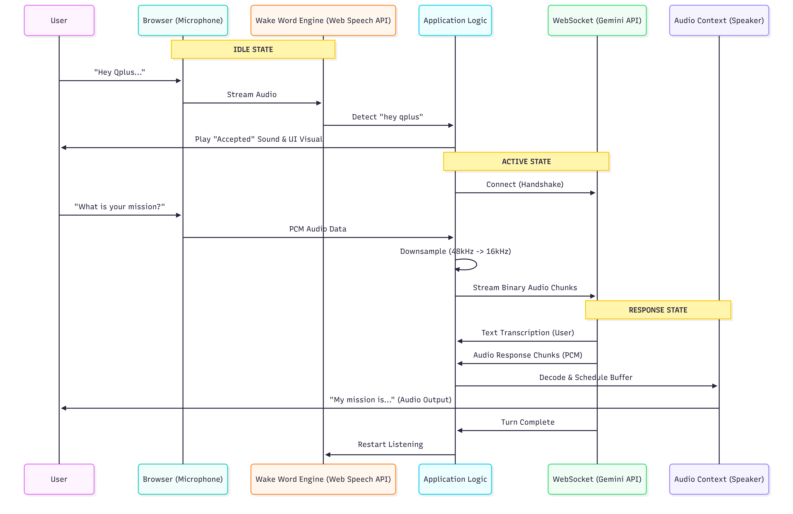

# High-Level Design (HLD): QPlus Voice Assistant

## 1. System Architecture

The following diagram illustrates the data flow from the user's speech input to the AI's audio response.

## 2. Technical Decisions & Nuances

### 2.1 Audio Pipeline
-   **Input Processing:** We use a `ScriptProcessorNode` (with a buffer size of 4096) to capture raw PCM data. While `AudioWorklet` is the modern standard, `ScriptProcessor` provides wider compatibility for this rapid prototype without requiring separate worker files.
-   **Downsampling:** The browser records at 44.1kHz or 48kHz. We downsample this to **16kHz** before sending it to the Gemini API. This reduces bandwidth usage by ~66%, significantly improving upload latency on slower networks.
-   **Output Processing:** We use `AudioBufferSourceNode` to play back the received PCM chunks. These are scheduled sequentially (`nextStartTimeRef`) to ensure gapless playback even if network packets arrive with jitter.

### 2.2 Latency Optimization (<1.2s Target)
To achieve the strict sub-1.2s latency goal:
1.  **Zero-Network Wake Word:** The "Hey Qplus" detection happens entirely locally using the Web Speech API. This eliminates the round-trip time (RTT) associated with cloud-based wake word verification.
2.  **Streaming Architecture:** We do not wait for the user to finish speaking. Audio is streamed in small chunks (approx. 250ms), allowing the server to begin processing mid-sentence (VAD - Voice Activity Detection is handled by Gemini).
3.  **Chunked Playback:** As soon as the first audio byte arrives from Gemini, it is decoded and played. We do not buffer the entire response.

### 2.3 State Management
The application implements a finite state machine (FSM) with the following states:
-   `IDLE`: Waiting for user activation (boot).
-   `LISTENING_WAKE_WORD`: Microphone active, local engine scanning for "Hey Qplus".
-   `ACTIVE_LISTENING`: WebSocket connected, streaming user audio to cloud.
-   `SPEAKING`: Playing back AI response.
-   `ERROR`: System halted due to permission or network issues.

Critical to this design is the **cleanup logic**. If the WebSocket disconnects or the user interrupts, all scheduled audio buffers are immediately cleared (`source.stop()`) to prevent "ghost audio" from playing.
